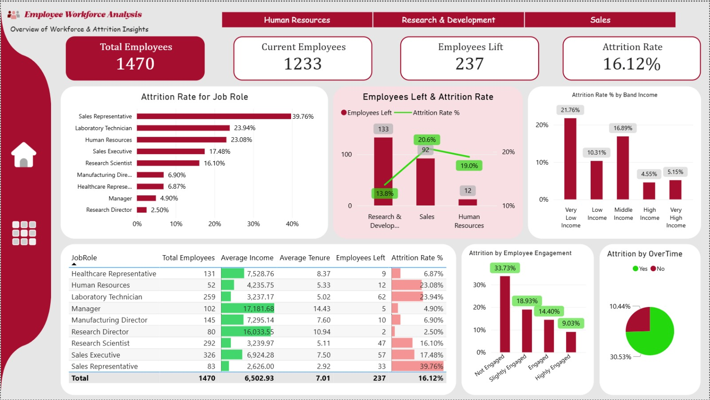
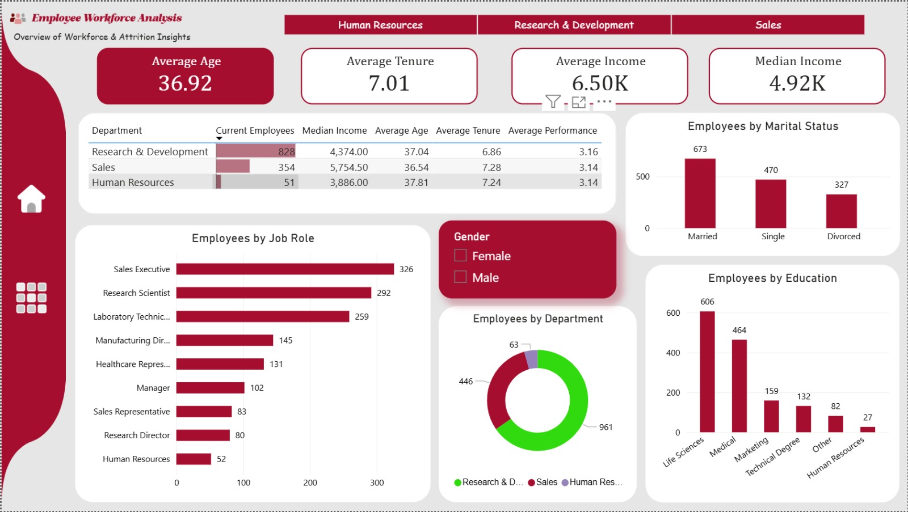

# HR-Workforce-Attrition-Analysis

An interactive HR Analytics dashboard built using **Power BI** to analyze workforce demographics, employee profiles, and attrition patterns. The project helps identify the key factors affecting employee turnover and supports data-driven HR decision-making.

---

# Business Objectives

- Analyze the current workforce structure.
- Measure employee attrition across departments and job roles.
- Identify high-risk employee segments.
- Discover factors influencing employee turnover.
- Provide actionable insights for HR decision-makers.

---

# Tools & Technologies

- Power BI
- Power Query
- DAX
- Microsoft Excel

---

# Dashboard Pages

## 1️⃣ Attrition Analysis

Analyzes employee turnover and identifies the most influential factors behind attrition.

### KPIs
- Total Employees
- Current Employees
- Employees Left
- Attrition Rate

### Analysis
- Attrition by Job Role
- Attrition by Department
- Attrition by Employee Engagement
- Attrition by Income Band
- Attrition by Overtime

---

## Preview

---

## 2️⃣ Workforce Overview

Provides a complete overview of the organization's workforce.

### KPIs
- Total Employees
- Average Age
- Average Tenure
- Average Income
- Median Income

### Analysis
- Department Distribution
- Job Role Distribution
- Education Level
- Marital Status
- Gender Filter

---

## Preview

---

# 📈 Key Insights

- Employees with **low engagement** have the highest attrition rate.
- Employees working **overtime** are significantly more likely to leave the company.
- Lower-income employees experience noticeably higher attrition rates.
- **Sales Representatives** have the highest attrition rate among all job roles.
- Departments with the highest number of resignations do **not necessarily** have the highest attrition rate. Attrition should always be evaluated relative to department size.

---

# 📌 Skills Demonstrated

- Data Cleaning
- Data Modeling
- Power Query
- DAX Measures
- HR Analytics
- Data Visualization
- Business Intelligence
- Dashboard Design
- Business Insights

---

# 👤 Author

**Hesham Mohamed**

Data Analyst

- LinkedIn: *(www.linkedin.com/in/mohamed-hesham-296b8832b)*

---

⭐ If you found this project useful, feel free to give it a star.
